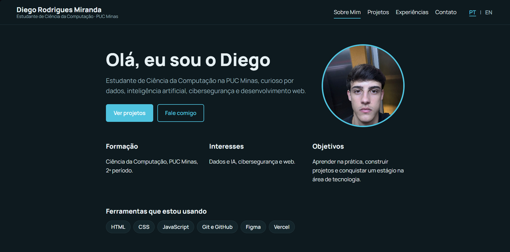
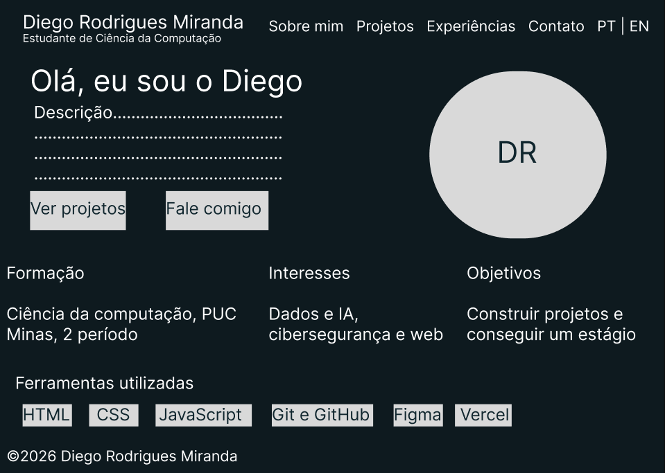
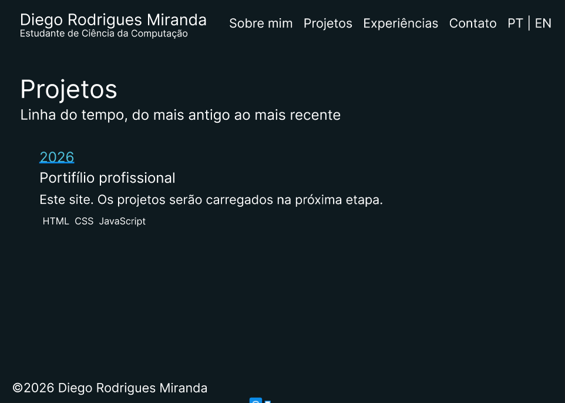
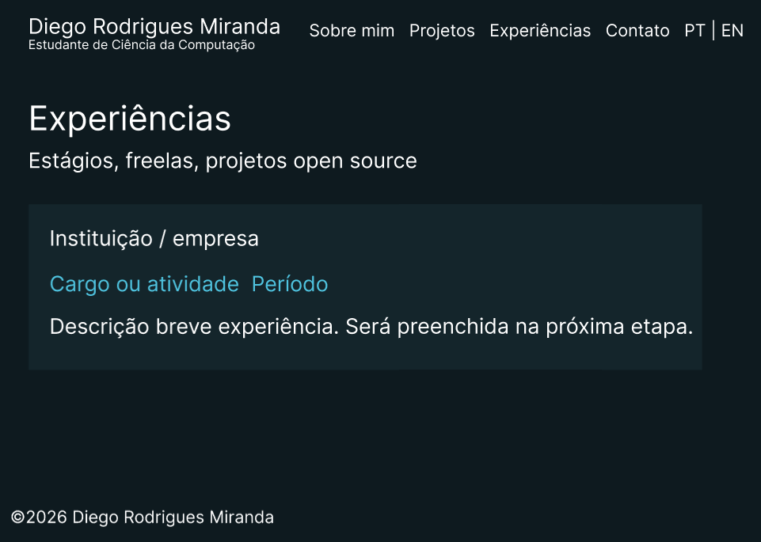
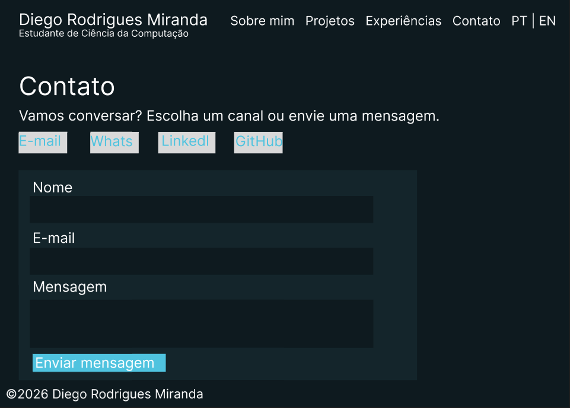

# Portfólio Profissional — Diego Rodrigues Miranda

Website de portfólio profissional para apresentar minha trajetória, meus projetos, minhas experiências e formas de contato de maneira moderna e acessível.

Projeto desenvolvido no **Laboratório 01** da disciplina de **Desenvolvimento de Interfaces Web (DIW)**, do curso de Ciência da Computação da PUC Minas.

🔗 **Site publicado:** [https://portifolio-alpha-swart-88.vercel.app](https://portifolio-alpha-swart-88.vercel.app)



---

## Sumário

- [Funcionalidades](#funcionalidades)
- [Tecnologias utilizadas](#tecnologias-utilizadas)
- [Dependências e bibliotecas](#dependências-e-bibliotecas)
- [Estrutura de diretórios](#estrutura-de-diretórios)
- [Protótipos (Figma)](#protótipos-figma)
- [Identidade visual](#identidade-visual)
- [Como executar localmente](#como-executar-localmente)
- [Configuração do formulário de contato](#configuração-do-formulário-de-contato)
- [Como adicionar projetos e experiências](#como-adicionar-projetos-e-experiências)
- [Hospedagem](#hospedagem)
- [Processo de desenvolvimento](#processo-de-desenvolvimento)
- [Autor](#autor)

---

## Funcionalidades

O site possui quatro seções, acessadas por um menu de navegação:

| Seção | O que apresenta |
|---|---|
| **Sobre Mim** | Apresentação com foto, formação, interesses, objetivos e ferramentas, com versões em **português e inglês** (botão PT \| EN). |
| **Projetos** | **Linha do tempo dinâmica**, do projeto mais antigo ao mais recente. Cada projeto mostra nome, descrição, tecnologias, imagem e link para o repositório no GitHub. |
| **Experiências** | Cartões com instituição, cargo ou atividade, período e descrição. |
| **Contato** | Ícones clicáveis (e-mail, WhatsApp, LinkedIn e GitHub) e **formulário com validação** e envio por e-mail. |

Características gerais:

- **Design responsivo**, adaptado a celulares, tablets e computadores.
- **Troca de idioma (PT/EN)** em todas as páginas, com a escolha lembrada pelo navegador.
- **Conteúdo dinâmico**: projetos e experiências são gerados por JavaScript a partir de um único arquivo de dados (`js/data.js`).
- **Tema claro/escuro** automático, conforme a preferência do sistema do visitante.
- **Acessibilidade básica**: HTML semântico, navegação por teclado com foco visível, rótulos nos campos e nos ícones.
- **Validação do formulário** (nome, e-mail e mensagem) antes do envio.

---

## Tecnologias utilizadas

- **HTML5** — estrutura semântica das páginas.
- **CSS3** — layout com Flexbox e Grid, variáveis CSS, *media queries* e tema claro/escuro.
- **JavaScript (ES6+)** — troca de idioma, renderização da timeline e das experiências, validação e envio do formulário.
- **Figma** — wireframes de média fidelidade.
- **Git e GitHub** — versionamento e hospedagem do código.
- **EmailJS** — envio de e-mails diretamente do front-end, sem back-end próprio.
- **Vercel** — hospedagem gratuita do site na nuvem, com *deploy* automático a cada `git push`.

---

## Dependências e bibliotecas

O projeto não usa gerenciador de pacotes nem etapa de *build*. As bibliotecas abaixo são carregadas por CDN, diretamente nos arquivos HTML:

| Biblioteca | Versão | Uso | Origem |
|---|---|---|---|
| [Font Awesome](https://fontawesome.com/) | 6.5.2 | Ícones da página de Contato | cdnjs |
| [EmailJS Browser SDK](https://www.emailjs.com/) | 4.x | Envio do formulário por e-mail | jsDelivr |
| [Manrope](https://fonts.google.com/specimen/Manrope) | — | Fonte do site | Google Fonts |

---

## Estrutura de diretórios

```
portifolio/
├── index.html            # Sobre Mim (página inicial)
├── projetos.html         # Timeline de projetos
├── experiencias.html     # Experiências
├── contato.html          # Contato (ícones e formulário)
├── css/
│   └── style.css         # Estilos, responsividade e temas
├── js/
│   ├── data.js           # Dados de projetos e experiências (PT/EN)
│   └── script.js         # Idiomas, renderização, validação e EmailJS
├── img/
│   ├── foto.jpeg                  # Foto de perfil
│   ├── projeto-portfolio.png      # Imagem do projeto "Portfólio profissional"
│   ├── wireframe-sobre.png        # Wireframe: Sobre Mim
│   ├── wireframe-projetos.png     # Wireframe: Projetos
│   ├── wireframe-experiencias.png # Wireframe: Experiências
│   └── wireframe-contato.png      # Wireframe: Contato
└── README.md
```

**Como as peças se conectam:** o HTML define a estrutura de cada página; o CSS cuida da aparência; o `data.js` guarda o conteúdo; e o `script.js` lê esse conteúdo e monta a timeline e os cartões na tela, no idioma escolhido.

---

## Protótipos (Figma)

Os wireframes foram criados no Figma antes do desenvolvimento e serviram de base para o layout final.

### Sobre Mim


### Projetos


### Experiências


### Contato


<!--
Para incluir o link do arquivo no Figma, descomente a linha abaixo e cole o link:
[Ver protótipo no Figma](COLE-O-LINK-AQUI)
-->

---

## Identidade visual

Paleta escura, com um azul-turquesa de destaque, pensada para um perfil ligado a tecnologia. A fonte é a **Manrope**.

| Uso | Tema escuro | Tema claro |
|---|---|---|
| Fundo da página | `#0E1A1F` | `#F4F7F8` |
| Texto principal | `#E6F0F3` | `#10262E` |
| Texto secundário | `#9BB3BC` | `#4D6670` |
| Linhas e bordas | `#24373E` | `#D3DEE2` |
| Destaque (botões e links) | `#4FC3DF` | `#0B6E8A` |
| Fundo de cartões | `#14252B` | `#FFFFFF` |

---

## Como executar localmente

### Pré-requisitos

- Um navegador atualizado.
- [Git](https://git-scm.com/) (para clonar o repositório).
- [VS Code](https://code.visualstudio.com/) com a extensão **Live Server** (recomendado).

### Passo a passo

1. **Clone o repositório:**

   ```bash
   git clone https://github.com/diegorodrigues261107-byte/portifolio.git
   ```

2. **Entre na pasta do projeto:**

   ```bash
   cd portifolio
   ```

3. **Abra a pasta no VS Code:**

   ```bash
   code .
   ```

4. **Inicie o site:** clique com o botão direito em `index.html` e escolha **Open with Live Server**. O site abre em `http://127.0.0.1:5500`.

   Alternativa sem o VS Code, com Python instalado:

   ```bash
   python -m http.server 5500
   ```

   e acesse `http://localhost:5500`.

Não há dependências para instalar (`npm install` não é necessário).

---

## Configuração do formulário de contato

O envio de e-mails usa o [EmailJS](https://www.emailjs.com/). Para o formulário funcionar em uma cópia própria do projeto:

1. Crie uma conta gratuita no EmailJS.
2. Em **Email Services**, conecte um e-mail e anote o **Service ID**.
3. Em **Email Templates**, crie um template que use as variáveis `{{nome}}`, `{{email}}` e `{{mensagem}}`, com o seu e-mail em **To Email** e `{{email}}` em **Reply To**. Anote o **Template ID**.
4. Em **Account**, copie a **Public Key**.
5. No arquivo `js/script.js`, preencha o objeto:

   ```javascript
   const EMAILJS = { publicKey: "SUA_PUBLIC_KEY", serviceId: "SEU_SERVICE_ID", templateId: "SEU_TEMPLATE_ID" };
   ```

> A *Public Key* foi feita para ficar no código do front-end. A **Private Key** nunca deve ser colocada no site nem no repositório.

---

## Como adicionar projetos e experiências

Todo o conteúdo dinâmico fica em `js/data.js`. Para adicionar um projeto, inclua um novo bloco na lista `projects` (com uma vírgula depois do bloco anterior):

```javascript
{
  year: 2026,
  name: { pt: "Nome do projeto", en: "Project name" },
  desc: { pt: "O que ele faz.", en: "What it does." },
  tech: ["HTML", "CSS", "JavaScript"],
  repo: "https://github.com/seu-usuario/repositorio",
  image: "img/imagem-do-projeto.png"
}
```

A timeline ordena os projetos pelo ano, do mais antigo ao mais recente. As experiências seguem a mesma lógica, na lista `experiences`.

---

## Hospedagem

O site está publicado na **Vercel** (plano gratuito), com *deploy* automático: a cada `git push` na branch `main`, a Vercel publica a nova versão.

🔗 [https://portifolio-alpha-swart-88.vercel.app](https://portifolio-alpha-swart-88.vercel.app)

---

## Processo de desenvolvimento

| Etapa | Entrega |
|---|---|
| **Lab01S01** — Planejamento e prototipação | Repositório e README inicial, wireframes no Figma, protótipo do front-end com navegação e layout base. |
| **Lab01S02** — Funcionalidades principais | Sobre Mim em PT/EN, timeline dinâmica de projetos, experiências, contato com ícones e formulário funcional, validações e responsividade. |
| **Lab01S03** — Hospedagem e finalização | Deploy na Vercel, ajustes visuais e de usabilidade, imagem do projeto em execução e README final. |

---

## Autor

**Diego Rodrigues Miranda**
Estudante de Ciência da Computação — PUC Minas

- GitHub: [diegorodrigues261107-byte](https://github.com/diegorodrigues261107-byte)
- LinkedIn: [diegomiranda-ti](https://www.linkedin.com/in/diegomiranda-ti/)